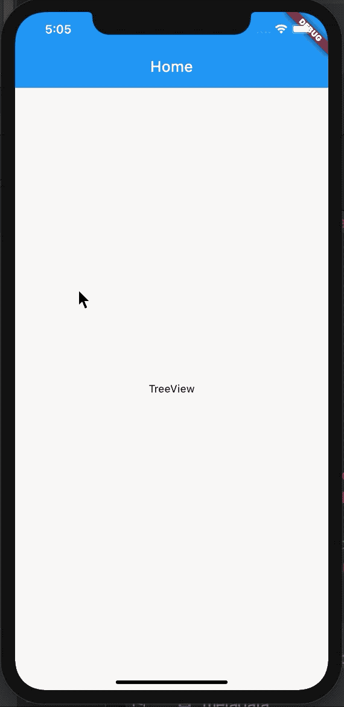

## ListTreeView
[A treeview for Flutter. Based on the listview](https://github.com/sooxie/list_treeview)

- Highly customizable. It only manages the tree structure of the data, and the UI is designed by yourself.
- Performance is efficient because of the Listview's reuse mechanism.
- Infinitely increasing child levels and child nodes





## Getting Started

### Installation

##### 1. Depend on it
```yaml
dependencies:
  list_treeview: ^0.0.1
```

##### 2. Install it
```dart
$ flutter pub get

```

#####  3. Import it
```dart
import 'package:list_treeview/list_treeview.dart'; pub get

```

## Usage

#### 1、Set the data for each row.
Your data class must inherit from **Nodedata**, nd you can customize other properties of the class.

```dart

/// The data class that is bound to the child node
/// You must inherit from NodeData ！！！
/// You can customize any of your properties
class TreeNodeData extends NodeData {
  TreeNodeData({this.label,this.color}) : super();

  /// Other properties that you want to define
  final String label;
  final Color color;
  String property1;
  String property2;
  String property3;
  ///...
}

```

The TreeViewController controls the data and expansion and contraction of the ListTreeview

```dart

TreeViewController _controller;
  @override
  void initState() {
    super.initState();

    var colors1 = TreeNodeData(label: 'Colors1');
    var color11 = TreeNodeData(label: 'rgb(0,139,69)', color: Color.fromARGB(255, 0 ,139 , 69));
    var color12 = TreeNodeData(label: 'rgb(0,139,69)', color: Color.fromARGB(255,0,191 ,255));
    var color13 = TreeNodeData(label: 'rgb(0,139,69)', color: Color.fromARGB(255,255 ,106, 106));
    var color14 = TreeNodeData(label: 'rgb(0,139,69)', color: Color.fromARGB(255,160 ,32, 240));
    colors1.addChild(color11);
    colors1.addChild(color12);
    colors1.addChild(color13);
    colors1.addChild(color14);

    var colors2 = TreeNodeData(label: 'Colors2');
    var color21 = TreeNodeData(label: 'rgb(0,139,69)', color: Color.fromARGB(255, 255 ,64, 64));
    var color22 = TreeNodeData(label: 'rgb(0,139,69)', color: Color.fromARGB(255,28, 134, 238));
    var color23 = TreeNodeData(label: 'rgb(0,139,69)', color: Color.fromARGB(255,255 ,106, 106));
    var color24 = TreeNodeData(label: 'rgb(0,139,69)', color: Color.fromARGB(255,205 ,198, 115));
    colors2.addChild(color21);
    colors2.addChild(color22);
    colors2.addChild(color23);
    colors2.addChild(color24);
    /// set data
    _controller = TreeViewController(data: [colors1,colors2]);
  }

```

#### Insert

```dart
_controller.insertAtFront(dataNode,newNode);
//    _controller.insertAtRear(dataNode, newNode);
//    _controller.insertAtIndex(1, dataNode, newNode);

```

#### Remove

```dart
_controller.removeItem(item);
```

