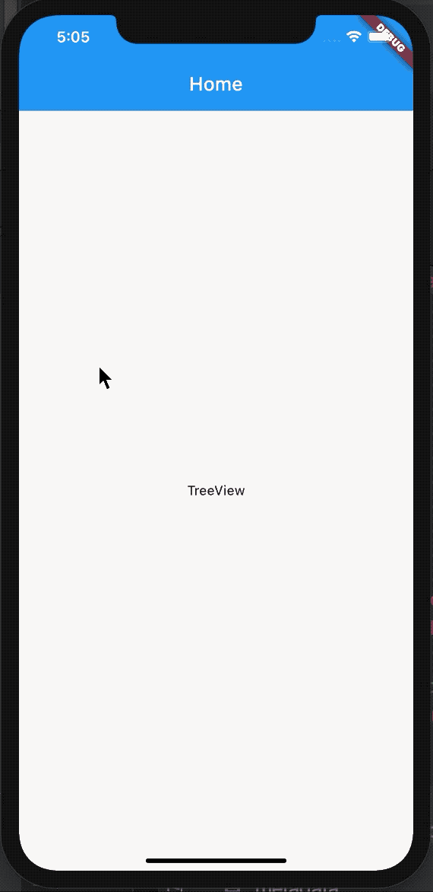
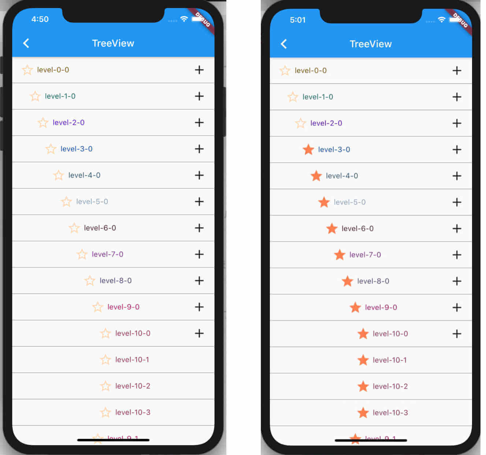

English | [简体中文](./README_CN.md)

# ListTreeView

[](https://pub.dev/packages/list_treeview)
[](./LICENSE)
[](https://flutter.dev)

A tree view for Flutter, built on top of `ListView`. It manages the tree
structure of your data and leaves the UI entirely to you.

## Features

- **Bring your own UI.** The widget only manages the tree structure of the
  data — you design every row yourself in an `itemBuilder`.
- **Efficient.** Rows are recycled through `ListView`'s builder, so only
  visible nodes are built.
- **Unlimited depth.** Child levels and child nodes can grow infinitely.
- **Imperative control.** Insert, remove, expand/collapse, and select nodes
  through a controller.
- **Flutter 3.0+ / Dart 3**.

## Preview




## Installation

Run this command:

```bash
flutter pub add list_treeview
```

This adds a line like the following to your package's `pubspec.yaml` (and runs
an implicit `flutter pub get`):

```yaml
dependencies:
  list_treeview: ^0.4.0
```

Then import it in your Dart code:

```dart
import 'package:list_treeview/list_treeview.dart';
```

## Quick start

### 1. Initialize the controller

The controller must be created before the tree view is built — usually in
`initState`.

```dart
class _TreePageState extends State<TreePage> {
  late TreeViewController _controller;

  @override
  void initState() {
    super.initState();
    _controller = TreeViewController();
  }
}
```

### 2. Define your data model

Your data class **must extend `NodeData`**. Beyond that you can add any
properties you like. Make your own fields nullable (or give them defaults) so
they remain optional.

```dart
/// The data bound to each node.
/// You must extend [NodeData]; everything else is up to you.
class TreeNodeData extends NodeData {
  TreeNodeData({this.label, this.color}) : super();

  final String? label;
  final Color? color;
}
```

### 3. Provide the data

Build your node hierarchy with `addChild` and hand the root-level nodes to the
controller via `treeData`. Data can be loaded synchronously or asynchronously.

```dart
Future<void> loadData() async {
  // Data may be fetched asynchronously.
  await Future.delayed(const Duration(seconds: 1));

  final colors = TreeNodeData(label: 'Colors');
  colors.addChild(TreeNodeData(
      label: 'rgb(0,139,69)', color: const Color.fromARGB(255, 0, 139, 69)));
  colors.addChild(TreeNodeData(
      label: 'rgb(0,191,255)', color: const Color.fromARGB(255, 0, 191, 255)));

  final shapes = TreeNodeData(label: 'Shapes');
  shapes.addChild(TreeNodeData(label: 'Circle'));
  shapes.addChild(TreeNodeData(label: 'Square'));

  // Set the root-level nodes.
  _controller.treeData([colors, shapes]);

  setState(() {});
}
```

### 4. Build the tree

Render the tree with `ListTreeView`. Inside `itemBuilder`, cast the `NodeData`
back to your own type and use `level` to indent each row.

```dart
ListTreeView(
  controller: _controller,
  itemBuilder: (BuildContext context, NodeData data) {
    final item = data as TreeNodeData;
    return Padding(
      padding: EdgeInsets.only(left: item.level * 16.0),
      child: ListTile(
        title: Text(item.label ?? ''),
        // Show a chevron only for nodes that have children.
        trailing: item.children.isNotEmpty
            ? Icon(item.isExpand ? Icons.expand_less : Icons.expand_more)
            : null,
      ),
    );
  },
  onTap: (NodeData item) => debugPrint('tapped index ${item.index}'),
  onLongPress: (NodeData item) => _controller.removeItem(item),
);
```

> By default, tapping a row automatically expands or collapses it
> (`toggleNodeOnTap` is `true`). Set `toggleNodeOnTap: false` to drive
> expansion yourself with `expandOrCollapse`.

## Operations

### Insert

```dart
// Insert as the first child of [parent].
_controller.insertAtFront(parent, newNode);

// Append as the last child.
_controller.insertAtRear(parent, newNode);

// Insert at a specific index.
_controller.insertAtIndex(1, parent, newNode);

// Insert several nodes at the front in one call.
_controller.insertAllAtFront(parent, [nodeA, nodeB]);
```

By default a node is inserted only when its parent is expanded. Pass
`closeCanInsert: true` to insert even when the parent is collapsed:

```dart
_controller.insertAtFront(parent, newNode, closeCanInsert: true);
```

### Remove

```dart
_controller.removeItem(item);
```

### Expand / collapse

```dart
/// Toggle the node at a visible [index] (e.g. `item.index`).
_controller.expandOrCollapse(item.index);

/// Query the current state.
final expanded = _controller.isExpanded(item);
```

### Select

```dart
/// Select / deselect a single node.
_controller.selectItem(item);

/// Select / deselect a node together with all of its descendants.
_controller.selectAllChild(item);
```

Read the result via `item.isSelected` inside your `itemBuilder`.

## API reference

### `ListTreeView`

| Property          | Type                                       | Default              | Description                                                              |
| ----------------- | ------------------------------------------ | -------------------- | ------------------------------------------------------------------------ |
| `controller`      | `TreeViewController`                       | **required**         | Manages the tree data and operations.                                    |
| `itemBuilder`     | `Widget Function(BuildContext, NodeData)`  | **required**         | Builds the widget for each visible node.                                 |
| `onTap`           | `Function(NodeData)?`                      | `null`               | Called when a row is tapped.                                             |
| `onLongPress`     | `Function(NodeData)?`                      | `null`               | Called when a row is long-pressed.                                       |
| `toggleNodeOnTap` | `bool`                                     | `true`               | Auto expand/collapse a node on tap. Set `false` to control it yourself.  |
| `shrinkWrap`      | `bool`                                     | `false`              | Forwarded to the underlying `ListView`.                                  |
| `reverse`         | `bool`                                     | `false`              | Forwarded to the underlying `ListView`.                                  |
| `padding`         | `EdgeInsetsGeometry`                       | `EdgeInsets.all(0)`  | Padding around the list.                                                 |
| `removeTop`       | `bool`                                     | `true`               | Remove the top `MediaQuery` padding.                                     |
| `removeBottom`    | `bool`                                     | `true`               | Remove the bottom `MediaQuery` padding.                                  |

### `TreeViewController`

| Method                                                | Returns     | Description                                              |
| ----------------------------------------------------- | ----------- | ------------------------------------------------------- |
| `treeData(List? data)`                                | `void`      | Sets the root-level nodes.                              |
| `insertAtFront(parent, node, {closeCanInsert})`       | `void`      | Inserts `node` as the first child of `parent`.          |
| `insertAllAtFront(parent, nodes, {closeCanInsert})`   | `void`      | Inserts multiple nodes at the front.                    |
| `insertAtRear(parent, node, {closeCanInsert})`        | `void`      | Appends `node` as the last child.                       |
| `insertAtIndex(index, parent, node, {closeCanInsert})`| `void`      | Inserts `node` at `index`.                              |
| `removeItem(item)`                                    | `void`      | Removes `item` from the tree.                           |
| `expandOrCollapse(index)`                             | `TreeNode`  | Toggles the node at the visible `index`.                |
| `expandItem(treeNode)` / `collapseItem(treeNode)`     | `void`      | Expands / collapses a node.                             |
| `isExpanded(item)`                                    | `bool`      | Whether `item` is expanded.                             |
| `selectItem(item)`                                    | `void`      | Toggles the selection of `item`.                        |
| `selectAllChild(item)`                                | `void`      | Toggles the selection of `item` and all descendants.    |
| `indexOfItem(item)`                                   | `int`       | Visible index of `item`.                                |
| `levelOfNode(item)`                                   | `int`       | Depth level of `item`.                                  |
| `parentOfItem(item)`                                  | `NodeData?` | Parent of `item` (`null` for root-level nodes).         |
| `itemChildrenLength(item)`                            | `int`       | Number of direct children.                              |
| `numberOfVisibleChild()`                              | `int`       | Total number of currently visible rows.                 |
| `rebuild()`                                           | `void`      | Forces the tree to rebuild.                             |

### `NodeData`

Extend this class for your own model. The tree keeps the following fields up to
date, so you can read them inside `itemBuilder`:

| Property                  | Type               | Description                                              |
| ------------------------- | ------------------ | -------------------------------------------------------- |
| `children`                | `List<NodeData>`   | Direct child nodes. Use `addChild()` to append.          |
| `level`                   | `int`              | Depth of the node (root level is `0`). Use for indenting.|
| `index`                   | `int`              | Index among all currently visible nodes.                 |
| `indexInParent`           | `int`              | Index within the parent's `children`.                    |
| `isExpand`                | `bool`             | Whether the node is currently expanded.                  |
| `isSelected`              | `bool`             | Whether the node is selected.                            |
| `addChild(NodeData child)`| `void`             | Appends a child node.                                    |

## Example

A complete, runnable example lives in the [`example`](./example) directory. Run
it with:

```bash
cd example
flutter run
```

## License

Released under the [MIT License](./LICENSE).
