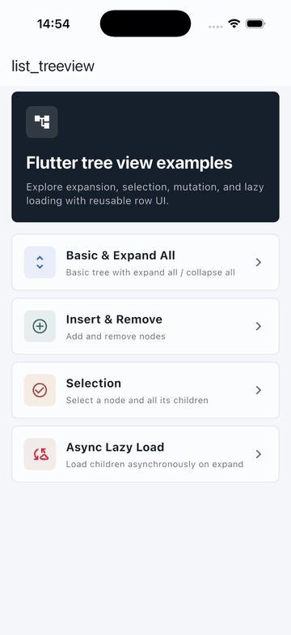
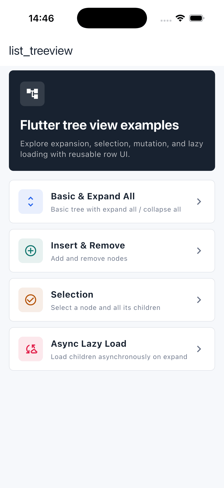
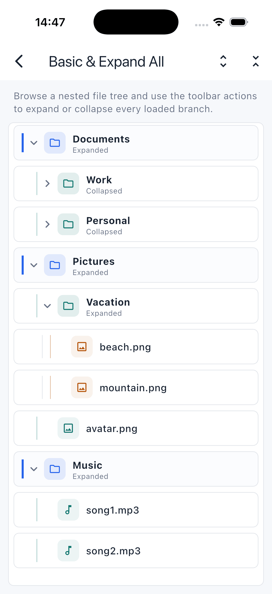
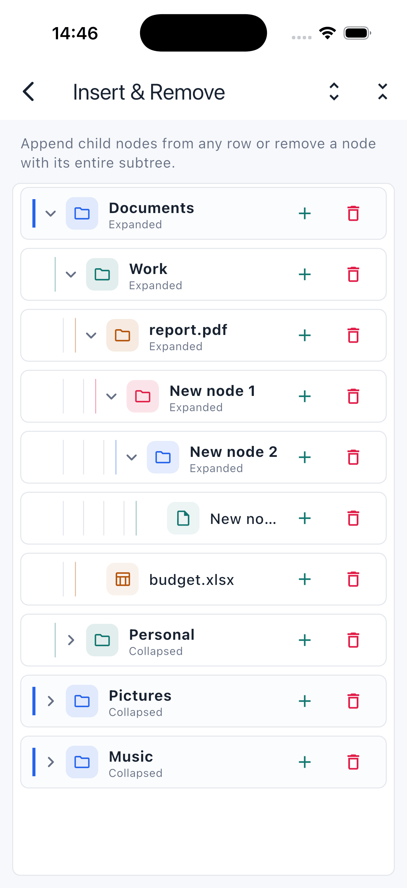
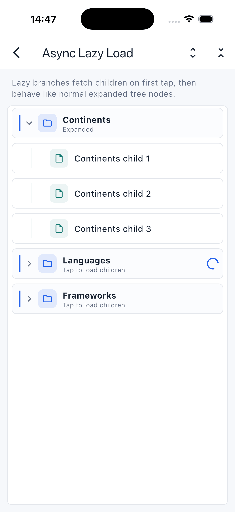

[English](./README.md) | 简体中文

# ListTreeView

[](https://pub.dev/packages/list_treeview)
[](./LICENSE)
[](https://flutter.dev)

一个基于 `ListView` 的 Flutter 树形视图组件。它只负责管理数据的树形结构，UI
完全交给你来设计。

## 特性

- **UI 完全自定义。** 组件只管理数据的树形结构，每一行都由你在 `itemBuilder`
  里自行设计。
- **高效。** 通过 `ListView` 的 builder 复用行，只构建可见节点。
- **无限层级。** 子层级和子节点可以无限增加。
- **命令式控制。** 通过 controller 进行插入、删除、展开/折叠、选中等操作。
- **支持 Flutter 3.0+ / Dart 3**。

## 预览

<p>
  
  
</p>

<table>
  <tr>
    <td align="center"><strong>基础与全部展开</strong></td>
    <td align="center"><strong>插入与删除</strong></td>
    <td align="center"><strong>选择</strong></td>
    <td align="center"><strong>异步懒加载</strong></td>
  </tr>
  <tr>
    <td></td>
    <td></td>
    <td></td>
    <td></td>
  </tr>
</table>

## 安装

运行以下命令：

```bash
flutter pub add list_treeview
```

该命令会在你的 `pubspec.yaml` 中添加如下依赖（并自动执行一次 `flutter pub
get`）：

```yaml
dependencies:
  list_treeview: ^0.4.0
```

然后在 Dart 代码中导入：

```dart
import 'package:list_treeview/list_treeview.dart';
```

## 快速开始

### 1. 初始化控制器

控制器必须在构建树视图之前创建，通常放在 `initState` 中。

```dart
class _TreePageState extends State<TreePage> {
  late TreeViewController _controller;

  @override
  void initState() {
    super.initState();
    _controller = TreeViewController();
  }
}
```

### 2. 定义数据模型

你的数据类**必须继承 `NodeData`**，除此之外可以自定义任意属性。请把自己的字段
设为可空（或给默认值），让它们保持可选。

```dart
/// 绑定到每个节点的数据。
/// 必须继承 [NodeData]，其余字段随你定义。
class TreeNodeData extends NodeData {
  TreeNodeData({this.label, this.color}) : super();

  final String? label;
  final Color? color;
}
```

### 3. 设置数据

用 `addChild` 构建节点层级，再通过 `treeData` 把根级节点交给控制器。数据可以同步
或异步加载。

```dart
Future<void> loadData() async {
  // 数据可以异步获取。
  await Future.delayed(const Duration(seconds: 1));

  final colors = TreeNodeData(label: 'Colors');
  colors.addChild(TreeNodeData(
      label: 'rgb(0,139,69)', color: const Color.fromARGB(255, 0, 139, 69)));
  colors.addChild(TreeNodeData(
      label: 'rgb(0,191,255)', color: const Color.fromARGB(255, 0, 191, 255)));

  final shapes = TreeNodeData(label: 'Shapes');
  shapes.addChild(TreeNodeData(label: 'Circle'));
  shapes.addChild(TreeNodeData(label: 'Square'));

  // 设置根级节点。
  _controller.treeData([colors, shapes]);

  setState(() {});
}
```

### 4. 构建树

用 `ListTreeView` 渲染树。在 `itemBuilder` 中把 `NodeData` 转回你自己的类型，并用
`level` 给每一行做缩进。

```dart
ListTreeView(
  controller: _controller,
  itemBuilder: (BuildContext context, NodeData data) {
    final item = data as TreeNodeData;
    return Padding(
      padding: EdgeInsets.only(left: item.level * 16.0),
      child: ListTile(
        title: Text(item.label ?? ''),
        // 仅对有子节点的节点显示展开箭头。
        trailing: item.children.isNotEmpty
            ? Icon(item.isExpand ? Icons.expand_less : Icons.expand_more)
            : null,
      ),
    );
  },
  onTap: (NodeData item) => debugPrint('tapped index ${item.index}'),
  onLongPress: (NodeData item) => _controller.removeItem(item),
);
```

> 默认情况下，点击某一行会自动展开或折叠它（`toggleNodeOnTap` 为 `true`）。设置
> `toggleNodeOnTap: false` 可改为用 `expandOrCollapse` 自行控制展开。

## 操作

### 插入

```dart
// 作为 [parent] 的第一个子节点插入。
_controller.insertAtFront(parent, newNode);

// 作为最后一个子节点追加。
_controller.insertAtRear(parent, newNode);

// 在指定索引处插入。
_controller.insertAtIndex(1, parent, newNode);

// 一次性在头部插入多个节点。
_controller.insertAllAtFront(parent, [nodeA, nodeB]);
```

默认只有当父节点处于展开状态时才会插入。传入 `closeCanInsert: true` 可在父节点折叠
时也插入：

```dart
_controller.insertAtFront(parent, newNode, closeCanInsert: true);
```

### 删除

```dart
_controller.removeItem(item);
```

### 展开 / 折叠

```dart
/// 切换可见 [index] 处的节点（例如 `item.index`）。
_controller.expandOrCollapse(item.index);

/// 一次性展开或折叠整棵树。
_controller.expandAll();
_controller.collapseAll();

/// 查询当前状态。
final expanded = _controller.isExpanded(item);
```

> **懒加载说明：** 子节点控制器只会在父节点展开时创建，因此 `expandAll()` 会展开树中
> 所有已加载子节点的节点。异步获取子节点的节点会先跳过，直到其子节点加载完成。

### 选中

```dart
/// 选中 / 取消选中单个节点。
_controller.selectItem(item);

/// 连同所有子孙节点一起选中 / 取消选中。
_controller.selectAllChild(item);
```

在 `itemBuilder` 中通过 `item.isSelected` 读取结果。

## API 参考

### `ListTreeView`

| 属性              | 类型                                       | 默认值               | 说明                                                  |
| ----------------- | ------------------------------------------ | -------------------- | ----------------------------------------------------- |
| `controller`      | `TreeViewController`                       | **必填**             | 管理树的数据与操作。                                  |
| `itemBuilder`     | `Widget Function(BuildContext, NodeData)`  | **必填**             | 为每个可见节点构建组件。                              |
| `onTap`           | `Function(NodeData)?`                      | `null`               | 点击某一行时回调。                                    |
| `onLongPress`     | `Function(NodeData)?`                      | `null`               | 长按某一行时回调。                                    |
| `toggleNodeOnTap` | `bool`                                     | `true`               | 点击时自动展开/折叠节点。设为 `false` 则自行控制。    |
| `shrinkWrap`      | `bool`                                     | `false`              | 透传给底层 `ListView`。                               |
| `reverse`         | `bool`                                     | `false`              | 透传给底层 `ListView`。                               |
| `padding`         | `EdgeInsetsGeometry`                       | `EdgeInsets.all(0)`  | 列表的内边距。                                        |
| `removeTop`       | `bool`                                     | `true`               | 移除顶部 `MediaQuery` 内边距。                        |
| `removeBottom`    | `bool`                                     | `true`               | 移除底部 `MediaQuery` 内边距。                        |

### `TreeViewController`

| 方法                                                  | 返回值      | 说明                                          |
| ----------------------------------------------------- | ----------- | --------------------------------------------- |
| `treeData(List? data)`                                | `void`      | 设置根级节点。                                |
| `insertAtFront(parent, node, {closeCanInsert})`       | `void`      | 将 `node` 作为 `parent` 的第一个子节点插入。  |
| `insertAllAtFront(parent, nodes, {closeCanInsert})`   | `void`      | 在头部插入多个节点。                          |
| `insertAtRear(parent, node, {closeCanInsert})`        | `void`      | 将 `node` 追加为最后一个子节点。              |
| `insertAtIndex(index, parent, node, {closeCanInsert})`| `void`      | 在 `index` 处插入 `node`。                    |
| `removeItem(item)`                                    | `void`      | 从树中移除 `item`。                           |
| `expandOrCollapse(index)`                             | `TreeNode`  | 切换可见 `index` 处节点的展开状态。           |
| `expandItem(treeNode)` / `collapseItem(treeNode)`     | `void`      | 展开 / 折叠某个节点。                         |
| `expandAll()`                                         | `void`      | 展开树中每个（已加载的）节点。                |
| `collapseAll()`                                       | `void`      | 折叠树中的每个节点。                          |
| `isExpanded(item)`                                    | `bool`      | `item` 是否处于展开状态。                     |
| `selectItem(item)`                                    | `void`      | 切换 `item` 的选中状态。                      |
| `selectAllChild(item)`                                | `void`      | 切换 `item` 及其所有子孙节点的选中状态。      |
| `indexOfItem(item)`                                   | `int`       | `item` 的可见索引。                           |
| `levelOfNode(item)`                                   | `int`       | `item` 的层级深度。                           |
| `parentOfItem(item)`                                  | `NodeData?` | `item` 的父节点（根级节点为 `null`）。        |
| `itemChildrenLength(item)`                            | `int`       | 直接子节点的数量。                            |
| `numberOfVisibleChild()`                              | `int`       | 当前可见行的总数。                            |
| `rebuild()`                                           | `void`      | 强制重建树。                                  |

### `NodeData`

继承该类来定义你自己的模型。树会持续更新以下字段，因此你可以在 `itemBuilder` 中
直接读取：

| 属性                      | 类型               | 说明                                          |
| ------------------------- | ------------------ | --------------------------------------------- |
| `children`                | `List<NodeData>`   | 直接子节点。用 `addChild()` 追加。            |
| `level`                   | `int`              | 节点深度（根级为 `0`），用于缩进。            |
| `index`                   | `int`              | 在所有可见节点中的索引。                      |
| `indexInParent`           | `int`              | 在父节点 `children` 中的索引。                |
| `isExpand`                | `bool`             | 节点当前是否展开。                            |
| `isSelected`              | `bool`             | 节点是否被选中。                              |
| `addChild(NodeData child)`| `void`             | 追加一个子节点。                              |

## 示例

[`example`](./example) 目录是一组可运行的功能示例，每个示例都有独立的详情页：

- **基础与全部展开** — 包含嵌套树，以及全部展开 / 全部折叠工具栏操作。
- **插入与删除** — 从任意行添加子节点，并删除整棵子树。
- **选择** — 选中某个节点及其所有子孙节点。
- **异步懒加载** — 首次点击分支时获取其子节点。

运行方式：

```bash
cd example
flutter run
```

## 许可证

基于 [MIT License](./LICENSE) 发布。
